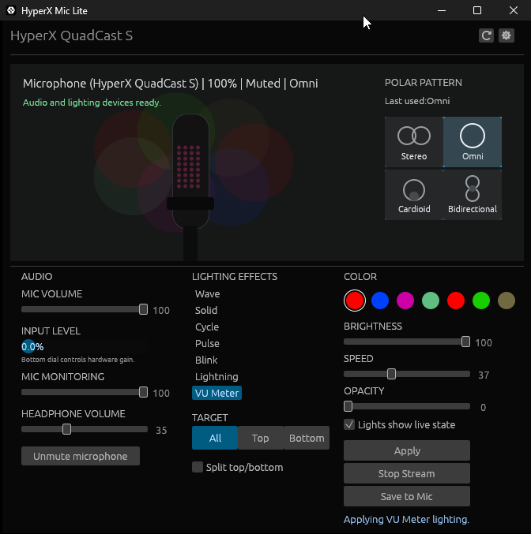

# HyperX Mic Lite

Lightweight Windows control software for the HyperX QuadCast S. It replaces the useful microphone, lighting, startup, diagnostics, service, and Home Assistant pieces without needing the full NGENUITY stack.



## Features

- Native Windows GUI for audio, lighting, device status, tray behavior, config import/export, diagnostics, and MQTT settings.
- Microphone mute/unmute/toggle and input volume control through Windows Core Audio.
- QuadCast S USB Audio Class topology controls for mic volume, mic monitoring, headphone volume, and mute toggles.
- Physical mute and polar-pattern HID event monitoring.
- Lighting writer for Solid, Wave, Cycle, Pulse, Blink, Lightning, and VU Meter effects.
- 16-cell lighting frame rendering, top/bottom/all targets, optional split-layer effects, and explicit `Save to Mic`.
- VU Meter lighting using direct input capture with smoothed flame-style output.
- Per-user GUI startup, close/minimize-to-tray behavior, and saved window position.
- Structured app logs, panic reports, diagnostics bundle export, and Windows Event Viewer source registration.
- Optional Windows service for boot-time audio restore and service health reporting.
- Optional MQTT and Home Assistant MQTT discovery for read/write control.

## Supported Device

The app targets the HyperX QuadCast S lighting controller:

- USB VID: `0951`
- USB PID: `171f`

Audio controls use the current Windows default communications capture endpoint plus QuadCast S USB topology controls where available. If Windows points at the wrong default microphone, the GUI shows a warning.

## Quick Start

Build the release binary:

```powershell
cargo build --release --locked
```

Run the GUI:

```powershell
.\target\release\hyperx-mic-lite.exe
```

Running with no arguments starts the GUI. If launched from a terminal, it also prints useful command examples.

## Useful CLI Commands

```powershell
.\target\release\hyperx-mic-lite.exe help
.\target\release\hyperx-mic-lite.exe status
.\target\release\hyperx-mic-lite.exe list
.\target\release\hyperx-mic-lite.exe mute
.\target\release\hyperx-mic-lite.exe unmute
.\target\release\hyperx-mic-lite.exe toggle
.\target\release\hyperx-mic-lite.exe volume 75
```

Lighting:

```powershell
.\target\release\hyperx-mic-lite.exe lighting-detect
.\target\release\hyperx-mic-lite.exe lighting-hid-dump
.\target\release\hyperx-mic-lite.exe hid-monitor 30
.\target\release\hyperx-mic-lite.exe level-monitor 10
.\target\release\hyperx-mic-lite.exe lighting-solid 00ff00 10
.\target\release\hyperx-mic-lite.exe lighting-effect wave forever
.\target\release\hyperx-mic-lite.exe lighting-effect vu_meter 30
.\target\release\hyperx-mic-lite.exe lighting-save --packet-log
```

Config and logs:

```powershell
.\target\release\hyperx-mic-lite.exe config path
.\target\release\hyperx-mic-lite.exe config dump
.\target\release\hyperx-mic-lite.exe config export .\hyperx-config.json
.\target\release\hyperx-mic-lite.exe config import .\hyperx-config.json
.\target\release\hyperx-mic-lite.exe config validate
.\target\release\hyperx-mic-lite.exe logs path
.\target\release\hyperx-mic-lite.exe logs tail 100
```

Diagnostics:

```powershell
.\target\release\hyperx-mic-lite.exe diagnostics export
.\target\release\hyperx-mic-lite.exe eventlog register
.\target\release\hyperx-mic-lite.exe eventlog status
```

`eventlog register` should be run from an elevated terminal once if you want friendly Event Viewer messages. `service install` also registers the provider.

## GUI

The GUI is the normal way to use the app. It includes:

- Audio controls and input level meter.
- Lighting controls, targets, color swatches, split top/bottom effects, Apply, Stop Stream, and Save to Mic.
- Physical polar-pattern display.
- Device status warnings for missing lighting HID, wrong default microphone, unsupported input meter, and write failures.
- Settings menu for tray behavior, mute-on-start, MQTT settings, config import/export, diagnostics export, and log tailing.

Lighting streams run while the app is open. Persistent device writes are explicit: normal Apply does not write the preset into microphone memory; `Save to Mic` does.

## MQTT And Home Assistant

MQTT is optional and disabled by default. Configure it from the GUI settings menu or by editing the JSON config.

Supported broker URL schemes:

- `mqtt://` or `tcp://` for plain MQTT.
- `mqtts://` or `ssl://` for TLS using system root certificates.
- `ws://` for WebSocket.
- `wss://` for secure WebSocket.

Example config:

```json
{
  "mqtt": {
    "enabled": true,
    "url": "mqtt://192.168.0.24:1883",
    "client_id": "hyperx-mic-lite",
    "username": "hyperx-mic-lite",
    "password": "hyperx-mic-lite",
    "base_topic": "hyperx_mic_lite/quadcast_s",
    "discovery_prefix": "homeassistant",
    "home_assistant_discovery": true,
    "retain_state": true,
    "qos": 1,
    "keep_alive_secs": 30,
    "clean_session": true
  }
}
```

State topics are published under:

```text
hyperx_mic_lite/quadcast_s/state/...
```

Command topics are subscribed under:

```text
hyperx_mic_lite/quadcast_s/command/...
```

Writable command keys:

- `mute`
- `mic_volume`
- `mic_monitoring`
- `headphone_volume`
- `effect`
- `target`
- `brightness`
- `speed`
- `opacity`
- `live_when_muted`
- `apply`
- `stop`
- `save`

When Home Assistant discovery is enabled, the app publishes MQTT discovery entities for switches, number sliders, sensors, selects, and buttons.

## Startup

Per-user GUI startup does not need admin:

```powershell
.\target\release\hyperx-mic-lite.exe startup install
.\target\release\hyperx-mic-lite.exe startup install --normal
.\target\release\hyperx-mic-lite.exe startup status
.\target\release\hyperx-mic-lite.exe startup uninstall
```

Default startup mode is minimized. Use `--normal` to open visibly at login.

## Windows Service

The service is intentionally narrow. It owns boot-time microphone restore, lifecycle/status, health heartbeat, and Event Viewer setup. The logged-in user session owns GUI rendering, tray behavior, interactive lighting streams, and HID events used by the UI.

```powershell
.\target\release\hyperx-mic-lite.exe service install
.\target\release\hyperx-mic-lite.exe service start
.\target\release\hyperx-mic-lite.exe service status
.\target\release\hyperx-mic-lite.exe service plan
.\target\release\hyperx-mic-lite.exe service stop
.\target\release\hyperx-mic-lite.exe service uninstall
```

Install/uninstall normally require an elevated terminal. Windows services run in Session 0, so they do not show desktop UI.

## Diagnostics And Logs

The app writes structured JSONL logs under the user app data directory. Diagnostics export includes:

- Manifest with app version and paths.
- Redacted config.
- Recent app log.
- Service health JSON.
- Core Audio device/status JSON.
- HID report-size details for supported lighting interfaces.

MQTT passwords, tokens, secrets, local paths, and device IDs are redacted in diagnostics exports.

## Developer Notes

The project is Windows-only.

Recommended local toolchain:

```powershell
cargo fmt --all -- --check
cargo check --all-targets --locked
cargo test --all-targets --locked
cargo build --release --locked
```

The build script embeds `resources/hyperx_messages.mc` when `windmc` and `windres` are available on PATH. If those tools are missing, the app still builds and Event Viewer falls back to registered provider records.

## Release Process

Use the `Release` GitHub Actions workflow. It accepts a semantic version, updates `Cargo.toml` and `Cargo.lock`, commits `Release vX.Y.Z`, tags `vX.Y.Z`, builds the Windows release binary, creates a zip package, generates a SHA-256 checksum file, uploads workflow artifacts, and publishes a GitHub Release.

Release artifacts:

- `hyperx-mic-lite-vX.Y.Z-windows-x86_64-msvc.zip`
- `hyperx-mic-lite-vX.Y.Z-windows-x86_64-msvc.zip.sha256`

The zip contains only `hyperx-mic-lite.exe`.

## Protocol Notes

The `captures/` directory documents USBPcap/Wireshark analysis for native lighting, audio slider, mode dial, save, reset-default, and startup-only behavior. Reset-default is intentionally documented but not implemented because the capture did not isolate a safe reset command.
